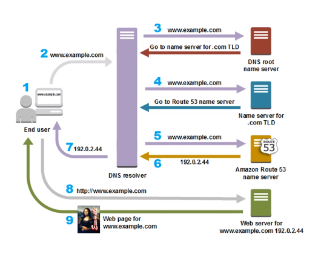

# DNS and Route 53 notes

## DNS

- Domain name system
- Translates human reabable domain names into IPs for computers
- Route 53 is DNS service

**Authorative vs Recursive**

- Different options for using AWS Route 53

**How DNS works in practice**

## A record

- Address record

## CNAME Record

- Maps Alias name to canonical domain name
- map subdown such as www
- Points to another dmoain address rather than IP address

## Alias records

- Route 53 specific extension for DNS functionality
- Alias similar to CNAME but enables having other DNS records on same hostname

## MX Records

- Resouce record in DNS
- Specifies mail server
- Can never point to CNAME record

## TTL

- Time takend for DNS to cache record
- Cache is high speed data storage level stored in ram
- Measured in seconds
- 1 hr (3600 secs) considered short. Websites wihtin this timeframe use a low focus to make fast changes 
- Otherwise ranges from 5 minutes to 3 days

## Propogation
- Time 